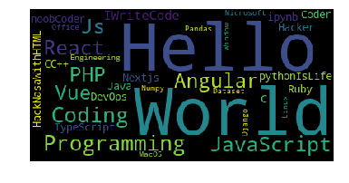

# WordCloud

## What is word cloud?
Word clouds (also known as text clouds or tag clouds) work in a simple way: the more a specific word appears in a source of textual data (such as a speech, blog post, or database), the bigger and bolder it appears in the word cloud.

## Technologies used
python and its modules used to create this
- wordcloud
- fileupload
- ipywidgets
- numpy

## Output of the following code:
